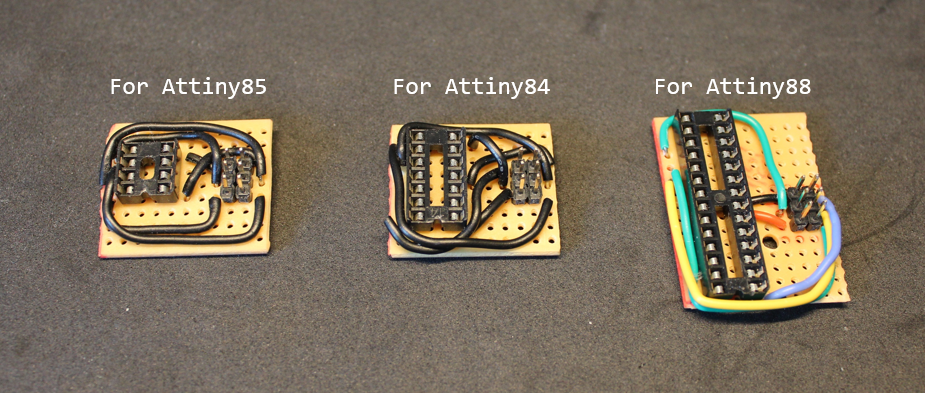

# Portable fan

There is a [video](https://youtu.be/3Dl_9heNABE) associated with this project, which I highly recommend watching if you are going to use this repository.

# Arduino

You can find the Arduino sketch in the `/Portable_Fan` directory.

- Since a potentiometer has noise and is not stable when reading from the ADC pin, to deal with this issue. I simply divide the raw ADC reading of the potentiometer by 100, which means the values can only be from 0-10. This removes all the noise from the lower signicant numbers. I then map this to 0-255 for the duty cycle. This is a very easy way to deal with the potentiometer noise.

## How to upload code to Attiny MCs

- The Attiny MCs can be programmed just like any Arduino and it's very easy to upload code to them.
- You just need a USBASP adapter, then simply make the connections as shown in the image below.

- You will also need to install the Attiny boards using the [AttinyCore](https://github.com/SpenceKonde/ATTinyCore) board manager by placing this link `http://drazzy.com/package_drazzy.com_index.json` to your "Additional Boards Manager URLs", which can be accessed in `File > Preferences`.

- From `Tools > Board`, choose your Attiny board with the no bootloader option.
- Then go to `Tools > Programmer` and choose `USBasp (ATTinyCore)`, and then press `Tools > Burn Bootloader`.
- Then to simply upload code, use `Sketch > Upload Using Programmer`.

- You can use stripboards with some wires to make uploading code to the Attiny MCs more convenient:

# Components

- DC motor, preferably with a high RPM such as 24,000 RPM.
- Attiny85, or any micro-controller that can produce a PWM signal.
- MOSFET, has to be a logic level MOSFET, here the IRF3708 is used.
- Potentiometer, 10k Ω.
- Diode, the 1N4004 is used.
- 18650 battery.
- Battery re-charging and protection circuit board, the TP4056 chip board is used.
- MCP1700 3.3 V voltage regulator, with 1000/100 µF and 100,000 pF capacitors soldered directly on it. This is used to power to Attiny, since it requires a stable power supply to operate as its best.
- A sliding switch.

# Wiring

## Schematic

## Breadboard

## Stripboard

# 3D printing

For all the 3D printed parts, please refer to the `/3d_models` directory.
